# Design and Configuration of a Highly Available 3-Tier Architecture on AWS

---

## Project Overview

This project demonstrates the deployment of a highly available 3-tier architecture on AWS. 
The system separates the User/Presentation Tier, Application Tier, and Data Tier across multiple Availability Zones to ensure scalability and fault tolerance.

---

# Architecture Diagram

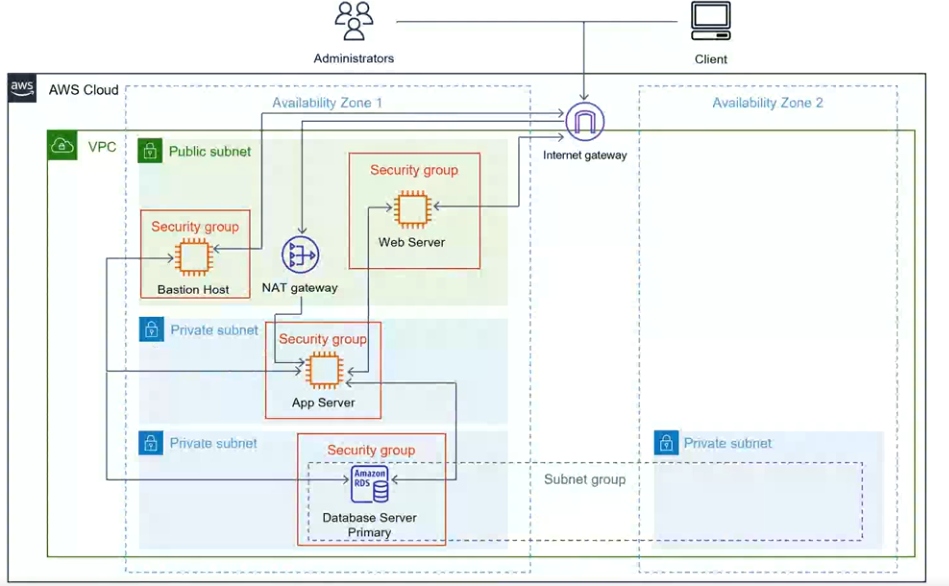

---

# Step 1: VPC Creation

Created a VPC with CIDR block 10.0.0.0/16.

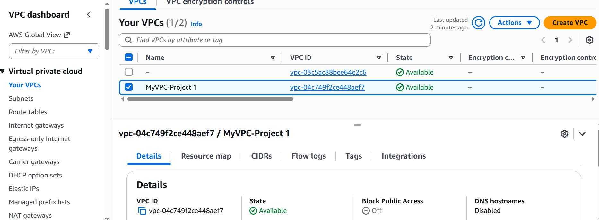

---

# Step 2: Subnet Configuration

Configured 6 subnets across 2 Availability Zones:

- 2 Public Subnets: PublicSubnet1, PublicSubnet5
- 2 Private Application Subnets: PrivateAppSubnet2, PrivateAppSubnet6
- 2 Private Database Subnets: PrivateDBSubnet3, PrivateDBSubnet4

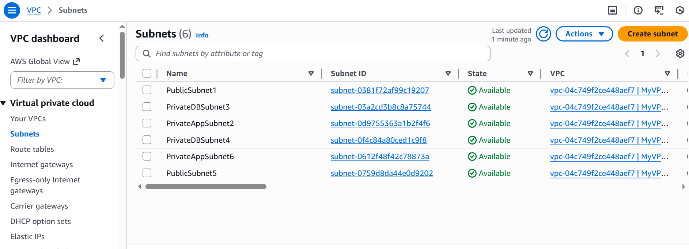

---

# Step 3: Internet Gateway & Route Table

Allocate elastic IP address
Configured Internet Gateway and updated Public Route Table.

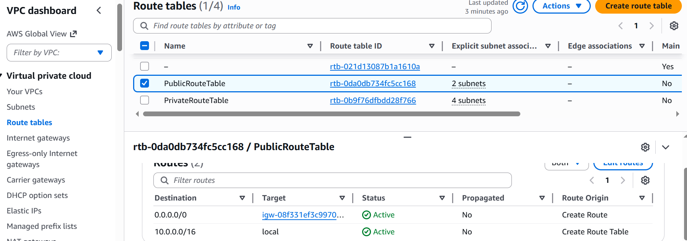

---

# Step 4: NAT Gateway Configuration

Created NAT Gateway in Public Subnet and updated Private Route Table.

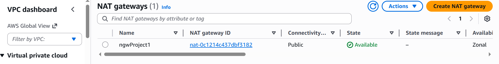

---

# Step 5: Security Groups

Configured separate security groups for:

- Bastion host
- Web servers
- Application servers
- Database servers
- Load balancer

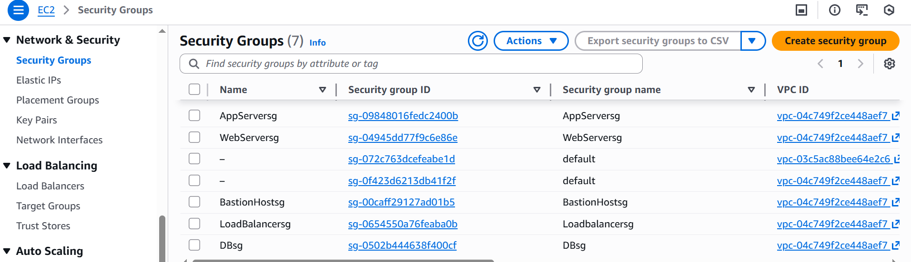

---

# Step 6: Creation of servers

Launched EC2 instances in private subnets and installed mariadb web server.

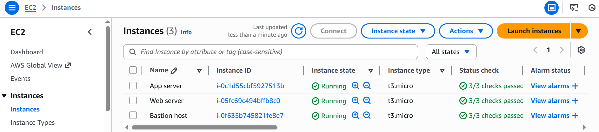

---

# Step 7: Load Balancer Configuration

Configured Application Load Balancer and attached Target Group.

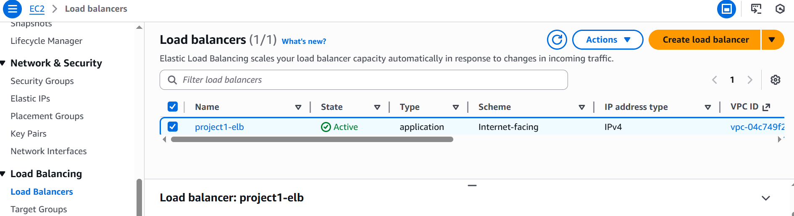

---

# Step 8: RDS Multi-AZ Deployment

Deployed MySQL RDS instance with Multi-AZ enabled.

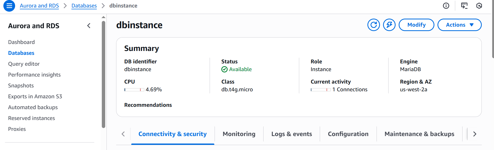

---
# Results
1. Able to access the app server, appserver2 and database server from the bastion host

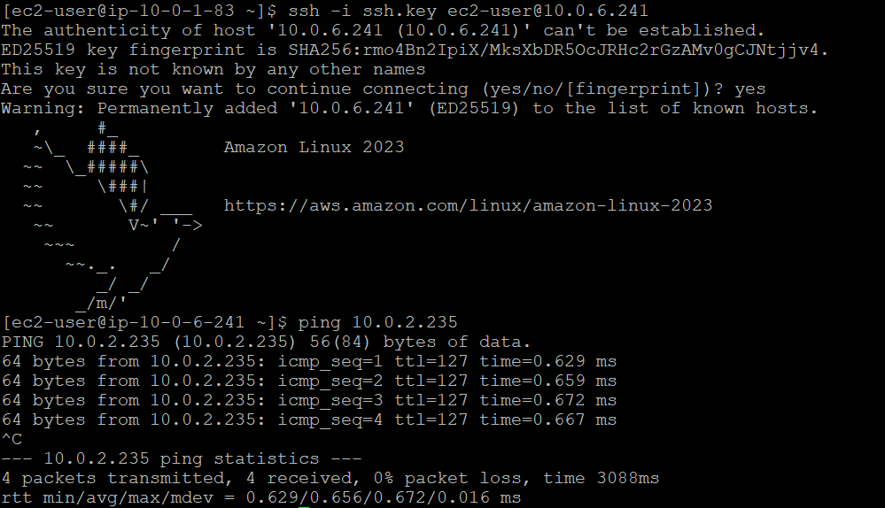

2. Ping test also confirms reachability of the servers from the bastion host

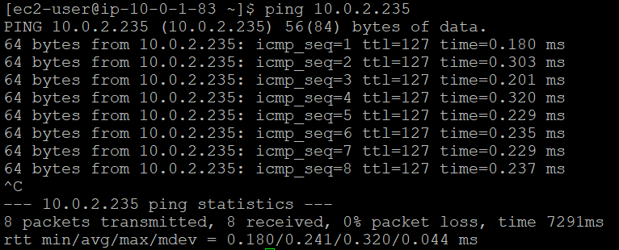

# Challenges Faced
# Challenge 1: Database Access Issue on Amazon Linux 2023
While configuring the Application Tier EC2 instance, installing the MySQL client using:
- sudo yum install mysql :resulted in an error.

Amazon Linux 2023 does not use yum as its default package manager. Instead, it uses dnf. Because of this, the required MySQL client package could not be installed using the expected command.

Solution: installed the MariaDB client using the correct package manager:
- sudo dnf install mariadb105.
After installation, successfully connected to the RDS instance using:
- mysql -h <RDS-endpoint> -u <username> -p
This resolved the database connectivity issue.

Key Learning
- Amazon Linux 2023 uses dnf instead of yum
- Always verify the operating system version before installing packages

# Challenge 2: AWS Free Tier Limitation – Multi-AZ RDS
The architecture design required a Multi-AZ RDS deployment to achieve full high availability in the Data Tier.
However, AWS Free Tier does not support Multi-AZ RDS instances. Enabling Multi-AZ requires a paid database instance.
Due to Free Tier constraints:
- Only Single-AZ RDS could be deployed
- True database-level high availability could not be fully implemented

Key Learning
- Free Tier is suitable for learning but has architectural limitations
- Production-grade high availability requires Multi-AZ database deployment
- Budget constraints must be considered during architecture design

---
# High Availability Features

- Multi-AZ Deployment
- Application Load Balancer
- Auto Scaling Group
- Multi-AZ RDS
- Private Subnet Isolation

---

# Security Considerations

- No public access to Application or Database tier
- Security groups follow least privilege principle
- NAT Gateway used for controlled outbound traffic
- Database accessible only from Application tier

