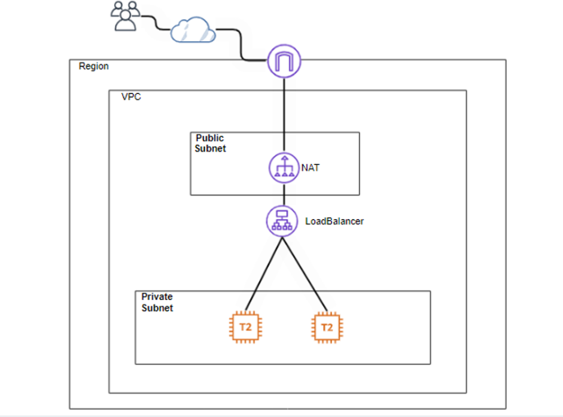
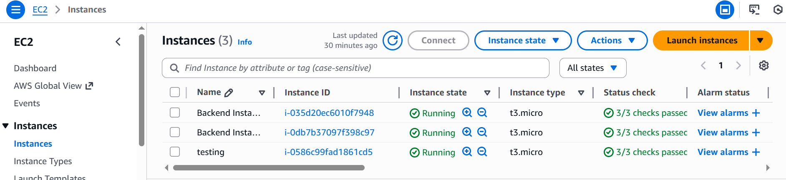
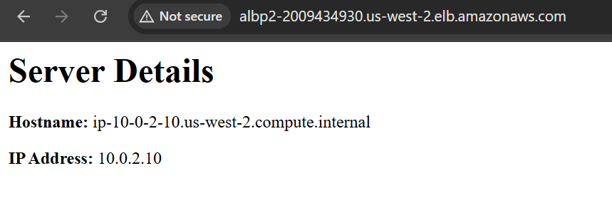
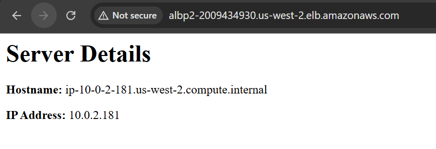

# Design and Configuration of Internet-Facing Load Balancer with Backend Instances

---

## Project Overview

This project demonstrates how to attach backend EC2 instances to an Internet-facing Application Load Balancer (ALB) on AWS.

The objective was to make application servers accessible to the internet through a secure and scalable load balancing layer while keeping backend instances controlled through security group rules.

---

## Architecture Diagram

---

## Step 1: VPC and Subnet Setup

Created a VPC with the following components:

- Public Subnets (for Load Balancer)
- Private Subnets (for Backend EC2 instances)

While the project was deployed in a single Availability Zone, in practice, subnets should be distributed across multiple Availability Zones to achieve high availability and fault tolerance.

---

## Step 2: Security Group Configuration

Configured separate security groups to enforce isolation and least privilege.

Load Balancer Security Group
- Allow HTTP (Port 80) from 0.0.0.0/0

Acts as the public entry point to the application

Backend EC2 Security Group

Allow HTTP (Port 80) ONLY from the Load Balancer Security Group and SSH (Port 22)

No direct public internet access

Prevents direct access to backend servers

## Step 3: Internet gateway, NAT gateway and route tables configuration

Created an internet gateway, attachedit to the projects' VPC and added a route to the IGW in public table created.

Created a NAT Gateway in a public subnet,allocated an Elastic IP to the NAT Gateway and updated the private route table to point 0.0.0.0/0 traffic to the NAT Gateway.

Associated public subnets with public route table as well as private subnets with private route table

## Step 4: Launch Backend EC2 Instances

Launched EC2 instances in private subnets.

## Step 5: Create Target Group

Created a Target Group with the following configuration:
- Target Type: Instance
- Protocol: HTTP
- Port: 80
- Registered backend EC2 instances to the Target Group.

Health checks ensure traffic is routed only to healthy instances.

## Step 6: Create Internet-Facing Application Load Balancer

Created an Application Load Balancer with:
- Scheme: Internet-facing
- Listener: HTTP (Port 80)
- Attached to Public Subnets
- Associated with the created Target Group

The Load Balancer distributes incoming traffic across multiple backend instances.

## Step 7: Verify Load Balancing

Accessed the DNS name of the Load Balancer from a web browser.

Traffic was successfully distributed across backend instances, confirming:
- Proper Target Group registration
- Health checks functioning correctly
- Secure communication between Load Balancer and backend servers

# Request routed to server 1

# Request routed to server 2

# High Availability Features

Internet-facing Application Load Balancer

Backend instances deployed across multiple Availability Zones

Health checks for automatic traffic routing

Scalable architecture design

# Security Considerations

Backend instances are not publicly accessible

Only the Load Balancer can communicate with backend servers

Principle of least privilege applied in security group rules

Public exposure limited strictly to the Load Balancer

Private subnet isolation for backend instances

## Challenges faced
Bastion Host and Backend Instance Configuration

During the deployment of the application behind the Application Load Balancer (ALB), the ALB marked the target instances as unhealthy, resulting in 502 Bad Gateway errors. This occurred because the backend instances were in a private subnet, making them inaccessible directly from the internet for verification and troubleshooting.

To resolve this, a bastion host was deployed and backend instances were configured appropriately.

# 1. Bastion Host Setup

A bastion host is an EC2 instance in a public subnet with a public IP that allows secure SSH access to private instances.

Steps taken:

- Launch an EC2 instance in the public subnet, named testing.
- Assign a security group allowing SSH (port 22).

Use this bastion host to SSH into private backend instances for verification and configuration.

Example: SSH from local machine to bastion host

ssh -i mykey.pem ec2-user@<bastion-public-ip>

Then SSH from bastion to private instance

ssh -i mykey.pem ec2-user@<private-instance-ip>

2. Backend Instance Verification and Fixes

On each private backend instance, the following were checked and configured:

Apache Installation and Service

sudo dnf install httpd -y

sudo systemctl enable httpd

sudo systemctl start httpd

Content Deployment

Created the index.html page for the ALB health check:

sudo tee /var/www/html/index.html > /dev/null <<EOF
<h1>Server Details</h1>

<strong>Hostname:</strong> $(hostname)

<strong>IP Address:</strong> $(hostname -I | awk '{print $1}')

EOF

3. Result

Once the backend instances were configured and reachable from the bastion host:

The ALB health checks passed.

The 502 Bad Gateway errors were resolved.

This setup ensures that private backend instances remain secure, while still being accessible for management through the bastion host.

💡 Key Takeaways:

Private instances cannot be accessed directly from the internet; a bastion host is required for administrative access.

ALB health checks fail if backend instances are misconfigured or unreachable.

Proper service, and content setup is crucial for backend instance health.
