# Bank Marketing Prediction using Amazon SageMaker XGBoost #
# Project Overview

This project demonstrates the end-to-end workflow for building, training, deploying, and evaluating a binary classification machine learning model on Amazon SageMaker. The model predicts whether a customer will subscribe to a term deposit based on marketing campaign data.

Used the Bank Marketing Dataset, preprocess it, train an XGBoost model, deploy it as a SageMaker endpoint, and evaluate its performance on test data.

# Project Steps
1. **Create Amazon Sagemaker Notebook Instance**

Select Notebook instances, then choose Create notebook instance
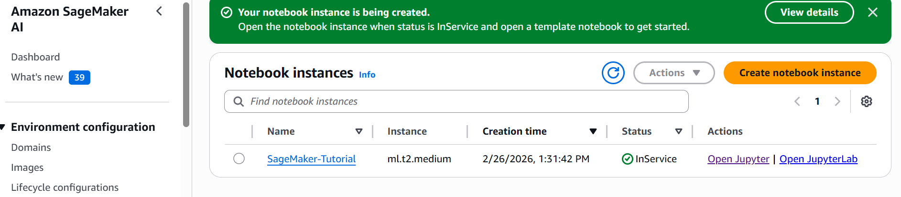

2.  **Import Libraries and Define Environment**
   
In Jupyter, choose conda_python3 and in a new code cell on your Jupyter notebook, copy and paste the following code and
choose Run.

Began by importing the required Python libraries and defining the SageMaker execution environment:

Define IAM role and session variables

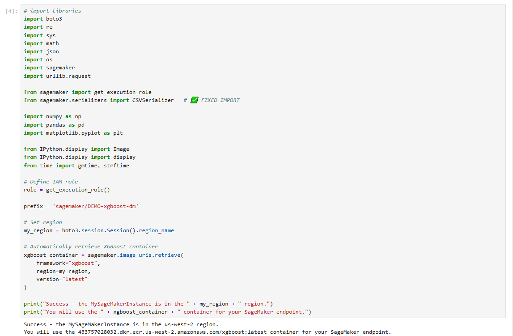

3. **Create S3 bucket**
Create the S3 bucket to store your data.

Provides storage for training data, model artifacts, and predictions. All training and output data is stored in Amazon S3.

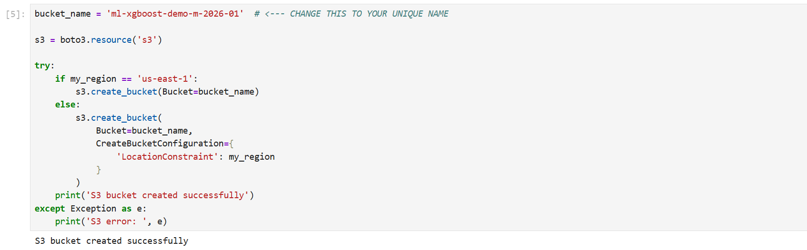

4. **Download and Load Data**

Downloaded the Bank Marketing dataset and loaded it into a Pandas DataFrame:

Purpose: Prepares raw data for preprocessing and training.

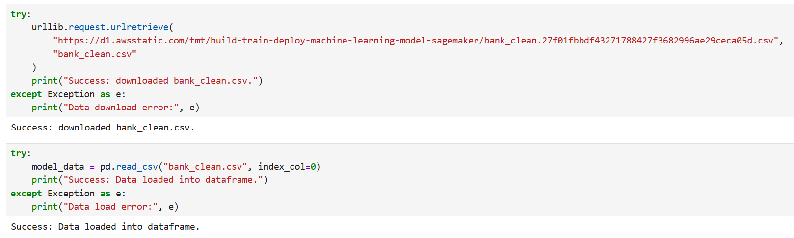

5. **Shuffle and Split Data**

Randomly shuffle the dataset and split it into training (70%) and test (30%) sets:

Test data is used to evaluate how well the model generalizes to unseen data.

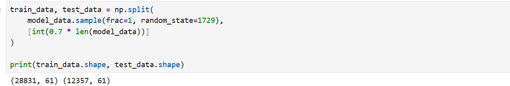

6. **Set up the Amazon SageMaker session**
   
Create an instance of the XGBoost model (an estimator), and define the model’s hyperparameters

Sets up the SageMaker session, IAM role, and identifies the XGBoost container for training.

7. **Upload Training Data to S3**
 
Stores training CSV in S3 for SageMaker to access.

Launches a training job on ml.m4.xlarge and optimizes model parameters using gradient-based optimization.

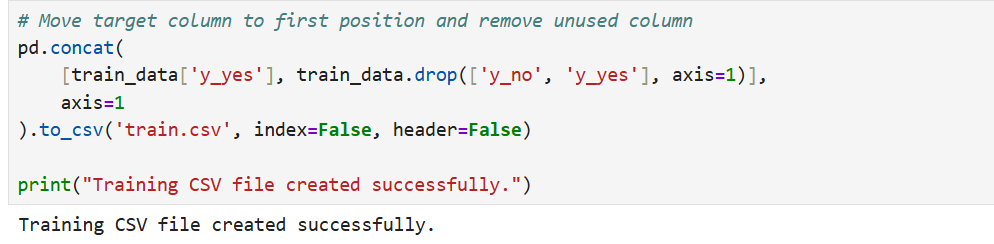

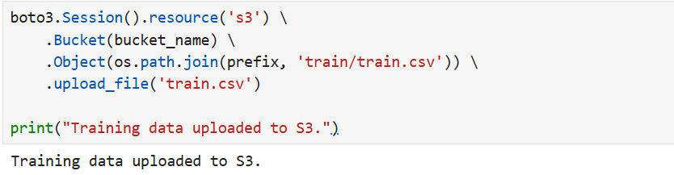

8. **Train the Model**
xgb.fit({'train': s3_input_train})

Launches a training job on ml.m4.xlarge and optimizes model parameters using gradient-based optimization.

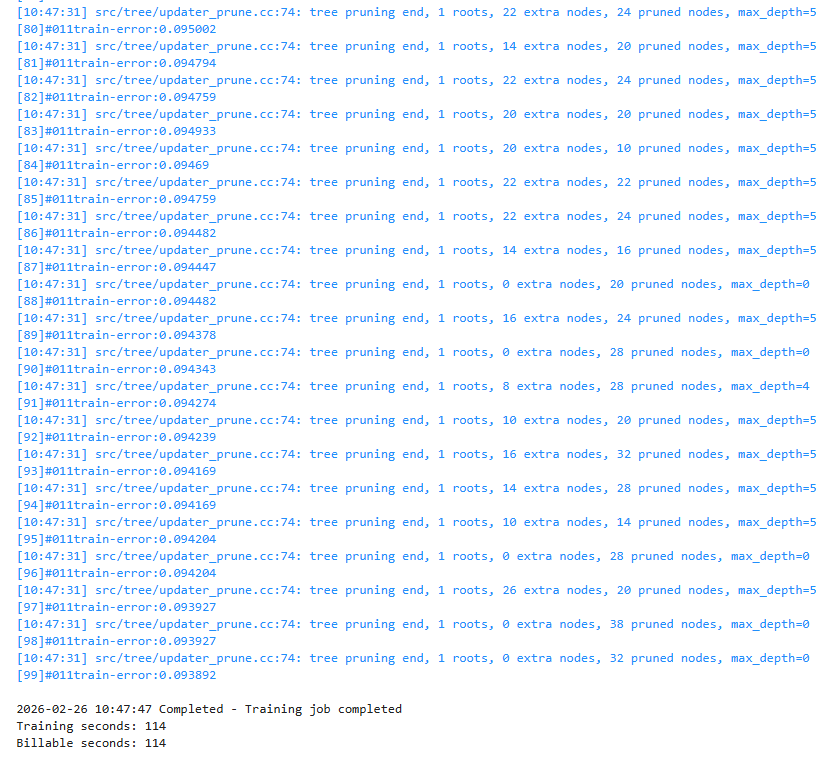

9. **Deploy the Model and configure SageMaker Estimator**
Create a real-time endpoint for making predictions.

Define the XGBoost estimator and hyperparameters:

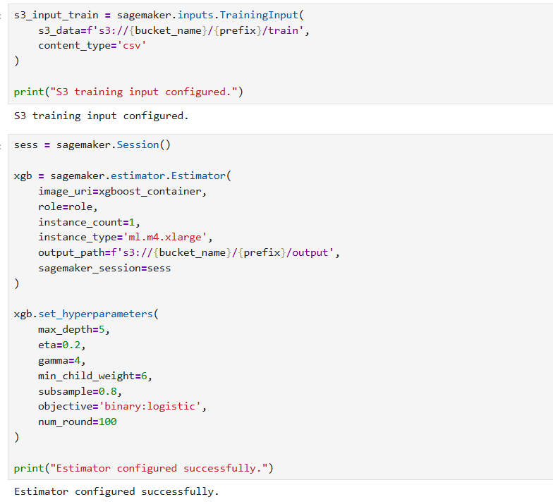

10. **Make Predictions on Test Data**

Converts test features into an array for model inference.

Predictions_array contains the predicted probabilities of a customer subscribing.

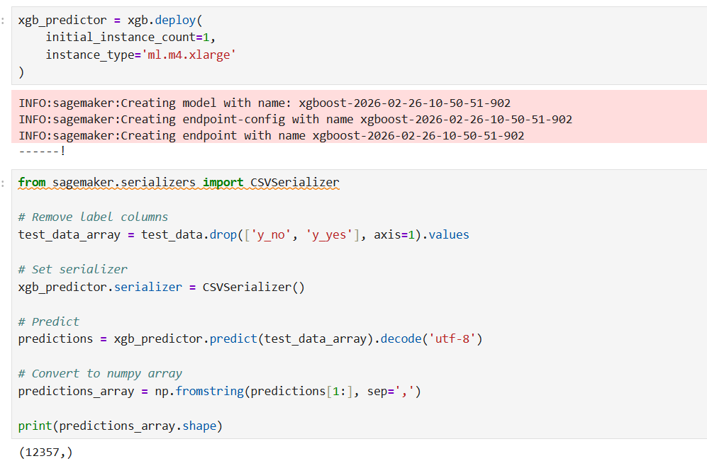

11. **Evaluate Model Performance**
Compares actual vs predicted outcomes using a confusion matrix.

Outcome: Measures accuracy, precision, and recall of the model.

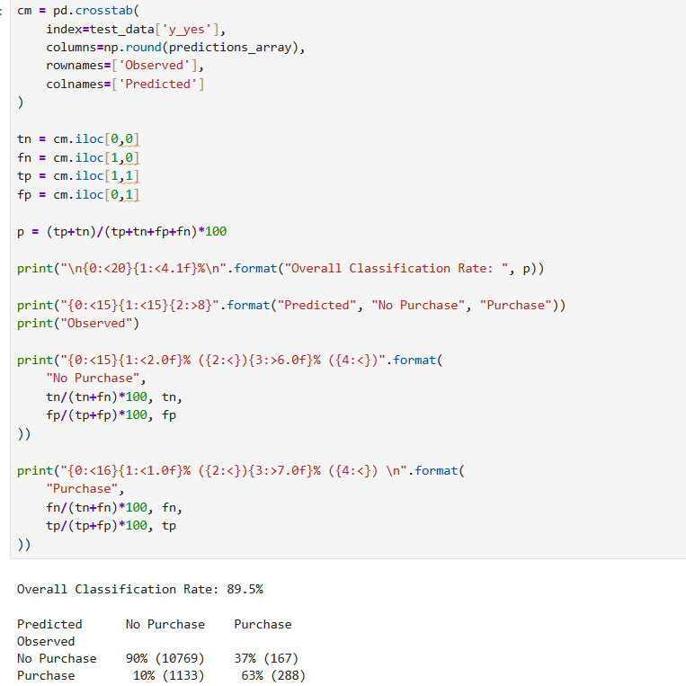

12. **Cleanup**

After evaluation, delete the endpoint to stop charges:

xgb_predictor.delete_endpoint()

SageMaker endpoints incur cost until deleted, so cleanup is crucial.

# Key Learnings

SageMaker simplifies end-to-end ML workflow:
- Data preparation
- Model training
- Deployment
- Prediction
- Evaluation

XGBoost is effective for binary classification tasks.

Using thresholds allows tuning precision vs recall for business objectives.

# References

https://docs.aws.amazon.com/sagemaker/latest/dg/gs-setup-working-env.html
