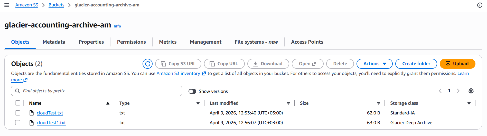
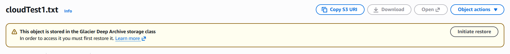
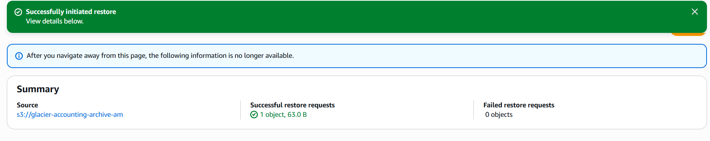

# Retrieving S3 Archives Using AWS Console

---

## Project Overview

This project demonstrates how to retrieve archived objects stored in Amazon S3 using the AWS Management Console.

The objective was to restore data from archival storage classes such as Glacier Deep Archive, making it temporarily accessible for download and use.

---

## Architecture Overview

The project involves:

- Amazon S3 bucket storing archived objects  
- Objects stored in archival storage classes:  
  - Glacier Deep Archive  
- AWS Console used to initiate and monitor retrieval  

---

## Step 1: Upload Object to S3 Archive Storage

1. Navigate to the S3 service in AWS Console  
2. Create or select an existing bucket.I created a bucket named glacier-accounting-archive-am.
3. Upload an object and during upload, select storage class.I uploaded a file named cloudTest in storage class standard-IA and cloudTest1 in storage class Glacier deep archive.

This ensures the object is stored in a low-cost archival tier.
## Successful upload to S3

---

## Step 2: Locate Archived Object

1. Open the S3 bucket  
2. Navigate to the object  
3. Confirm the storage class shows Glacier Deep Archive  

Archived objects are not immediately accessible.
## Inaccessible achived object

---

## Step 3: Initiate Restore Request

1. Select the archived object  
2. Click **Actions** → **Initiate restore**  
3. Configure restore options:
   - Restore duration (number of days the object will remain accessible)
   - Retrieval tier:
     - Standard (moderate time)
     - Bulk (slow, lowest cost)  

4. Submit restore request  
5. After initiating restore, check object status
## Object restore status

---

## Step 5: Access Restored Object

Once restoration is complete:

1. Object becomes temporarily accessible  
2. Download or use the object as needed  
3. Object remains available for the specified restore duration  

After this period, the object returns to archived state.

---

## Key Features

- Cost-effective long-term storage using archival classes  
- Flexible retrieval options based on urgency  
- Temporary restoration without permanent storage change  
- Managed entirely through AWS Console  

---

## Security Considerations

- Access controlled via IAM policies  
- Bucket permissions restrict unauthorized access  
- Data remains encrypted at rest in S3  
- Retrieval actions can be logged using AWS CloudTrail  

---

## Challenges Faced

### 1. Retrieval Delay

Archived objects are not instantly accessible and require time for restoration depending on the selected retrieval tier.

### 2. Cost Considerations

Faster retrieval options (e.g., Expedited) incur higher costs, requiring careful selection based on urgency.
### 3. Free Tier Limitation – Object Lock Not Supported

While working with Amazon S3 buckets under the AWS Free Tier, it was not possible to enable **Object Lock**.

#### Limitation

- Object Lock must be enabled at bucket creation  
- It requires versioning and additional configuration  
- Certain configurations are restricted or not fully supported in Free Tier environments  

As a result, implementing data immutability and compliance features (such as write-once-read-many policies) was not possible in this project.

---

## Lessons Learned

- S3 archival storage is cost-efficient but introduces access latency  
- Proper planning is required when retrieving archived data  
- Understanding retrieval tiers helps balance cost and performance  
- AWS Console provides a simple interface for managing archive retrieval  

---
