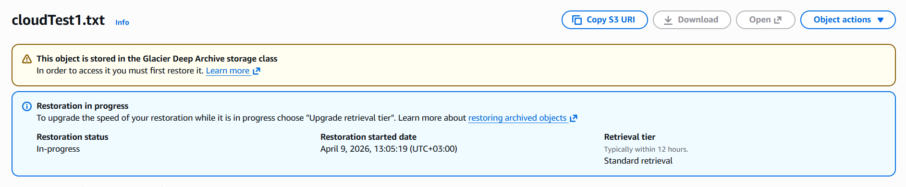
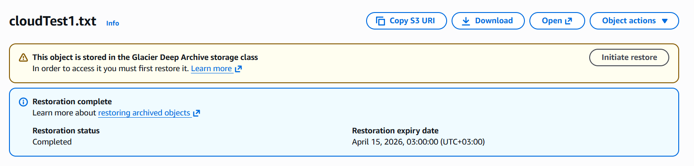

# Retrieving S3 Archives Using AWS Console

---

## Project Overview

This project demonstrates how to retrieve archived objects stored in Amazon S3 using the AWS Management Console.

The objective was to restore data from Glacier Deep Archive storage and make it temporarily accessible for use.

---

## Implementation Summary

- Created an S3 bucket named `glacier-accounting-archive-am`  
- Uploaded objects into different storage classes:
  - `cloudTest` → Standard-IA  
  - `cloudTest1` → Glacier Deep Archive  
- Initiated a restore request for the archived object  
- Monitored restoration status  
- Accessed the object after successful restore  

## Successful upload to S3

---

## Inaccessible archived object

---

## Retrieval Process

1. Uploaded object to Glacier Deep Archive  
2. Selected the object and initiated a restore request  
3. Chose retrieval tier (Standard or Bulk)  
4. Waited for restoration to complete  
5. Accessed the object within the specified restore duration

## Object restore request status

---

## Restoration status

---

## Object accessible

---

## Key Features

- Low-cost storage using Glacier Deep Archive  
- Flexible retrieval options based on urgency  
- Temporary object restoration without changing storage class  

---

## Challenges Faced

### Retrieval Delay

Archived objects are not immediately accessible. Retrieval takes time depending on the selected tier.

---

### Cost Considerations

Faster retrieval options increase cost, requiring a balance between speed and budget.

---

### Free Tier Limitation – Object Lock Not Supported

Object Lock could not be enabled under AWS Free Tier.

- Must be configured during bucket creation  
- Requires versioning  
- Not fully supported in Free Tier  

---

## Lessons Learned

- Archival storage reduces cost but introduces access delays  
- Retrieval tier selection impacts both cost and performance  
- Proper planning is required when working with archived data  
- AWS Free Tier may limit access to advanced features  
