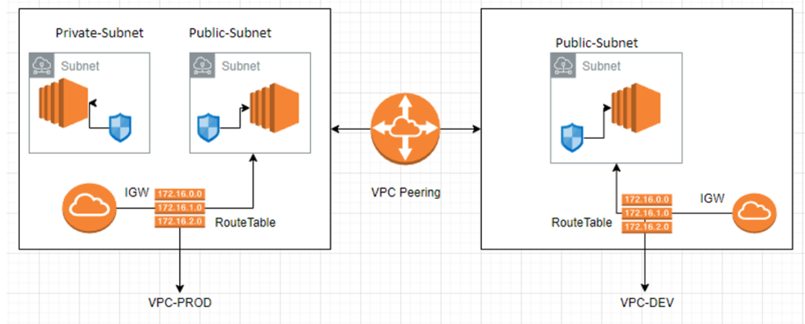
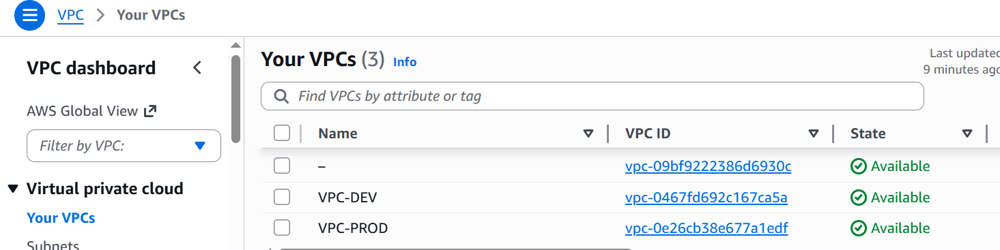
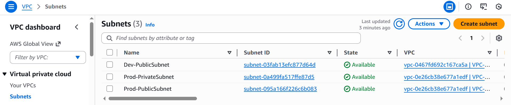
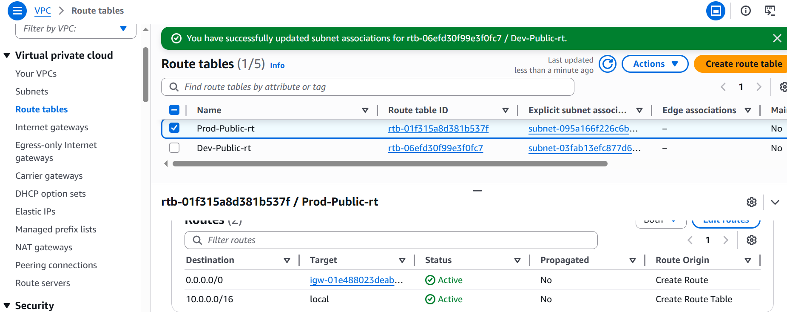
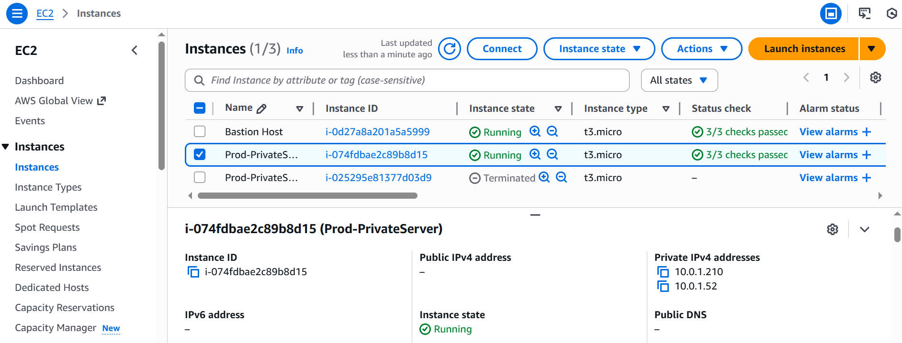
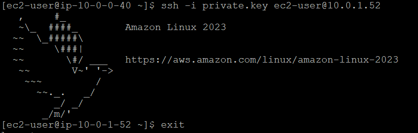
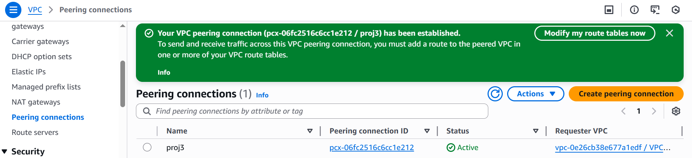

# Project: VPC Peering for Management Traffic Segregation

## Overview
This project demonstrates how to segregate management and application traffic in AWS using VPC peering. 

- Production (VPC-PROD) and Development (VPC-DEV) environments are isolated in separate VPCs.
- Private instances are shielded from the internet.
- Management and inter-VPC communication are routed securely via VPC peering.
- Public subnets allow controlled internet access where needed.

---

## Architecture Diagram

---

## Components

- **Production VPC - VPC-PROD**
  - CIDR: `10.0.0.0/16`
  - Hosts bastion or jump servers for administrative access
  - Allows outbound access to peered VPCs
  - Private Subnet: EC2 instances, databases, internal services
  - Public Subnet: Bastion host or jump server
  - Internet Gateway (IGW) for outbound internet access (public subnet)

- **Development VPC - VPC-DEV**
  - CIDR: `20.0.0.0/16`
  - Public Subnet: Development servers
  - Internet Gateway (IGW)

- **VPC Peering**
  - Allows private communication between VPC-PROD and VPC-DEV
  - No traffic goes over the public internet
    
- **Route Tables**
  - VPC-PROD routes private traffic to VPC-DEV via peering
  - VPC-DEV routes traffic to VPC-PROD via peering
    
- **Security Groups**
  - Instances allow SSH only from management VPC or bastion
  - Public instances allow outbound internet traffic

---

## Implementation Steps

1. **Create VPCs**

2. **Create Subnets**

3. **Create Internet gateways and Route tables**
- Created and attached IGWs to their VPCs
- Added routes to IGW in the route tables and associated the respective subnets

4. **Create Security group**
- Created security group allowing ssh traffic

5. **Create EC2 Instances in Prod-VPC**
- Created a bastion host in the public subnet of VPC-Prod and added security group created.
- Created a private instance with an additional network interface in the private subnet of VPC-Prod and added security group created.

  
- Tested ssh into private instance from bastion host and only one IP was able to connect to private instance
## Testing of ssh into private instance

6. **Create VPC Peering Connection**
- Created a VPC Peering between PROD-VPC and DEV-VPC by selecting Requestor and Accepter VPC
- Once Peering is created successfully, accepted the peering request
  

- Updated route tables to include peering connection with destination of CIDR range of the other VPC

7. **Create EC2 Instances in Dev-VPC**
- Created a public instance in the public subnet of VPC-Dev and added security group allowing SSH.

8.**Testing VPC Peering connection** 
To verify that the VPC peering connection was functioning correctly, the following tests were performed:

- Successfully connected from the bastion host in VPC-PROD to an instance in the public subnet of VPC-DEV.
- Installed and configured an Apache web server on the DEV instance to serve sample content.
- Updated security groups to allow HTTP (port 80) traffic where required.
- From the bastion host, accessed the Apache `index.html` page hosted in VPC-DEV.

## Successful access from bastion host

The successful display of the sample web page confirmed that:

- Routing between the two VPCs was correctly configured.
- The VPC peering connection was active and functioning.
- Security group rules allowed the intended cross-VPC communication.
- Instances in separate VPCs could securely communicate over private networking.

## Successful upload to S3
  
