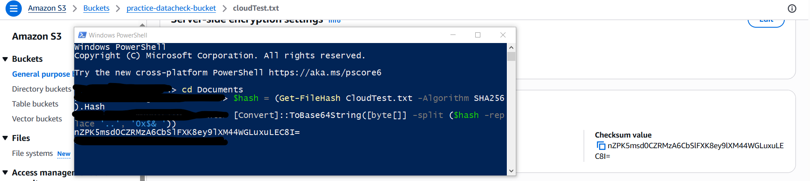

# Checking Data Integrity in Amazon S3 Using Additional Checksums

---

## Project Overview

This project demonstrates how to ensure data integrity in Amazon S3 by using additional checksum algorithms during object upload and verification.

The goal was to validate that data remains unaltered during transfer and storage using AWS-managed checksum mechanisms.

---

## Approach

Amazon S3 supports multiple checksum algorithms (CRC32, CRC32C, SHA-1, SHA-256) that can be applied during object upload.

In this project:

- A file was uploaded with a specified checksum algorithm  
- AWS automatically computed and stored the checksum  
- The checksum was later verified to confirm data integrity  

---

## Implementation Summary

- Created an S3 bucket in AWS  
- Uploaded an object while specifying a checksum algorithm (SHA-256)  
- Retrieved and verified the checksum from object properties  
- Cleaned up resources after testing
- 
## Checksum value verification

---

## Key Configurations

- **Storage Service:** Amazon S3  
- **Checksum Algorithm:** SHA-256  
- **Verification Method:** AWS Console (Object Properties)  

---

## Results

- Successfully uploaded objects with checksum validation  
- Verified checksum values after upload  
- Confirmed that data integrity was maintained  

---

## Lessons Learned

- Checksums are critical for ensuring data integrity in cloud storage  
- AWS S3 provides built-in mechanisms for integrity verification  
- Understanding storage features improves reliability and security design    
- Local checksum verification can be performed using PowerShell,this allows comparison between locally generated checksum values and those stored in Amazon S3:

```powershell
$hash = (Get-FileHash CloudTest.txt -Algorithm SHA256).Hash
[Convert]::ToBase64String([byte[]] -split ($hash -replace '..', '0x$& '))

